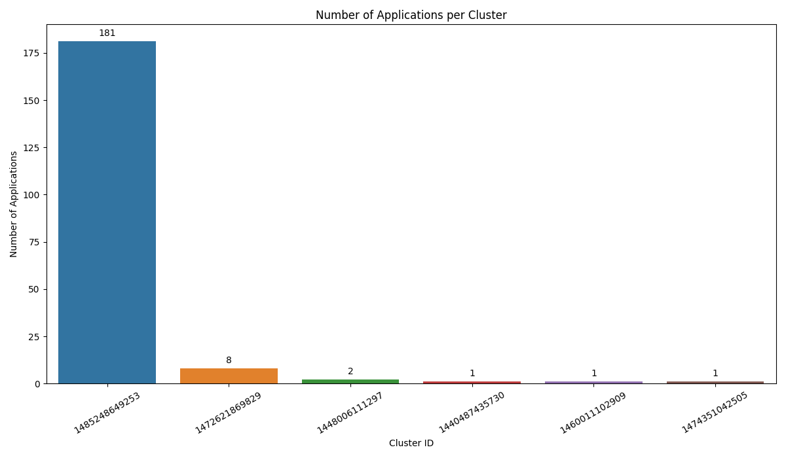
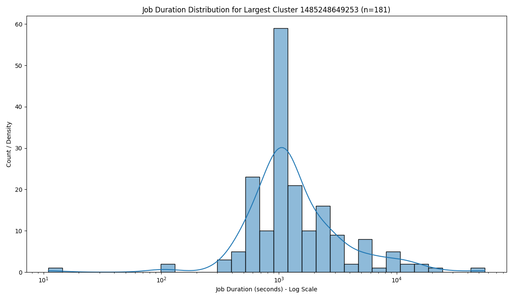
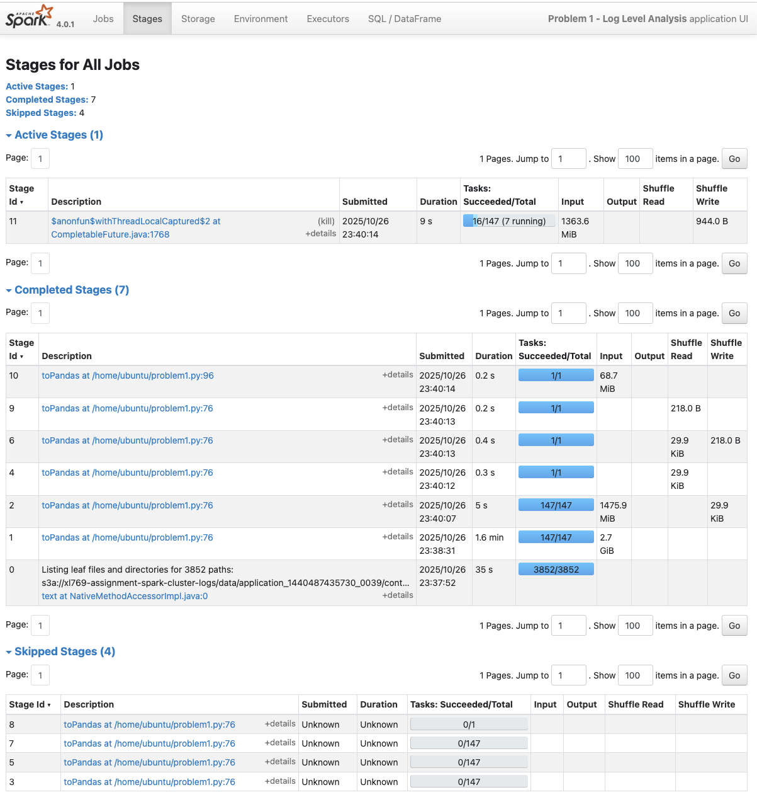
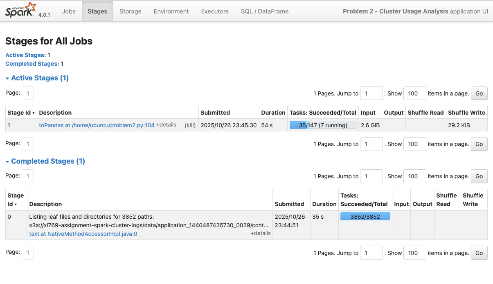

# Assignment 6: Spark Log Analysis Report

**Author:** Xun Lei
**NetID:** xl769

## Introduction

This assignment provides hands-on experience with Apache Spark by analyzing real-world Spark cluster logs using PySpark. I will set up a Spark cluster on AWS EC2 and perform distributed data analysis on approximately 2.8 GB of production log data.

## Problem 1: Log Level Distribution

### Approach

To analyze the log level distribution, the script first read all log files from either the S3 bucket or a local sample directory using `spark.read.text()`. It then extracted the log level (INFO, WARN, ERROR, DEBUG) from each line using a regular expression via `regexp_extract()` and filtered out lines that did not contain a valid level. For efficiency, this filtered DataFrame was cached. The counts for each log level were calculated using `groupBy('log_level').count()`. These aggregated counts, along with a small random sample of log entries obtained using `.sample().limit(10)`, were converted to Pandas DataFrames via `.toPandas()` and saved as single CSV files (`problem1_counts.csv`, `problem1_sample.csv`). Finally, overall statistics like total lines processed and lines with levels were computed using Spark's `.count()`, the level counts were collected to the driver using `.collect()`, and a detailed summary including percentages was written to `problem1_summary.txt` using standard Python file I/O. 

### Key Findings & Insights

The analysis covered 33,236,604 log lines in total, with 27,410,336 yielding a valid log level. The logs were heavily skewed towards routine operations, as INFO messages made up 99.92% (27,389,482 lines) of the valid entries. Potential issues were rare, as both WARN (9,595 lines, 0.04%) and ERROR (11,259 lines, 0.04%) messages occurred infrequently, indicating relatively stable cluster performance. DEBUG messages were entirely absent. 

## Problem 2: Cluster Usage Analysis

### Approach

For the cluster usage analysis, the script first determined the input path (either S3 or local sample) based on the `spark_master` argument and read the log files. It then parsed each line to extract the timestamp string using `regexp_extract()`, converted it to a proper timestamp with `to_timestamp()`, and filtered out lines without valid timestamps. Using `input_file_name()` and `regexp_extract()`, it derived the `application_id`, `cluster_id`, and `app_number` for each log entry. The script calculated the start and end times for each application by grouping by these IDs and aggregating using `min()` and `max()` on the timestamp column, caching the resulting `app_times_df`. This timeline data (194 rows) was then converted to a Pandas DataFrame and saved as a single file, Subsequently, it aggregated the timeline data by `cluster_id` to count applications and find the earliest start and latest end times per cluster, ordering by application count. Statistics like total clusters, total applications, and average applications per cluster were calculated from these results. I also uses Seaborn to generated bar chart  and density plot; This function can be run independently using the `--skip-spark` flag.

### Key Findings & Insights

We found logs from **6 different computer clusters** running a total of **194 Spark jobs**. It turns out almost all the action happened on just **one main cluster** (ID `1485248649253`). This single cluster ran **181 out of the 194 jobs** – that's about 93% of all the work!. The other 5 clusters barely did anything; one ran 8 jobs, another ran 2, and the rest only ran 1 job each, as you can clearly see in the bar chart. When we looked closer at how long jobs took on that main busy cluster using the density plot, the times were really spread out. We had to use a log scale on the chart's x-axis just to see everything clearly, because some jobs finished super fast while others took hours. Most jobs seemed to finish around the 17-minute mark (1000 seconds), but there was definitely a noticeable group that took way longer, even over 2.7 hours (10,000+ seconds).

### Explanation of Visualizations

* **Bar Chart**:

    * This chart visually represents the total number of Spark applications executed on each unique cluster identified in the dataset.
    * It clearly highlights the dominance of a single cluster, `1485248649253`, which ran 181 applications. The distribution is extremely uneven, with the next most active cluster (`1472621869829`) running only 8 applications, and the remaining four clusters running just 1 or 2 applications each, demonstrating a highly centralized workload during the periods logged.

* **Density Plot**:

    * This density plot compares application durations across six clusters using a logarithmic scale. Each cluster shows a distinct pattern: while cluster 1485248649253has a concentration of jobs around 10³ seconds, others like 1472621869829are skewed toward shorter runs. A common long tail indicates that most jobs are short, but a minority run for significantly longer, revealing different workload profiles per cluster.

### Performance Observations

* **Execution Time**:
    * Running locally on the small sample took roughly 10s for Problem 1 and 30s for Problem 2. On the cluster with the full dataset, Problem 1 completed in approximately 2 minutes, and Problem 2 took about 3 minutes. While slower than the sample run, the cluster efficiently processed the full 2.8GB dataset within the expected time frame.
* **Optimizations**:
    * Testing was performed on the local sample data first using the `local[*]` Spark master setting. This approach significantly sped up the debugging process for parsing logic (timestamps, IDs) and aggregation steps, preventing wasted time waiting for longer jobs to fail on the full dataset on the cluster.
    * `.cache()` was used on the `app_times_df` DataFrame in `problem2.py`. This was beneficial because this intermediate DataFrame, containing the calculated start and end times for each application, was used twice: once to generate the `problem2_timeline.csv` output and again to calculate the `cluster_summary_df` for `problem2_cluster_summary.csv` and `problem2_stats.txt`. Caching avoids recomputing these application timelines from the raw logs.
    

## Spark Web UI Screenshots

* **Problem 1**:

* **Problem 2**:
 
   

## Conclusion 

This assignment was a great way to learn by doing. I successfully set up a Spark cluster on AWS using the provided scripts and used PySpark to dig into real Spark logs. The main things I found were that the logs were mostly just routine INFO messages, suggesting things ran smoothly most of the time. Also, it was pretty clear that almost all the action happened on just one cluster (`1485248649253`), which ran way more jobs than any others. 